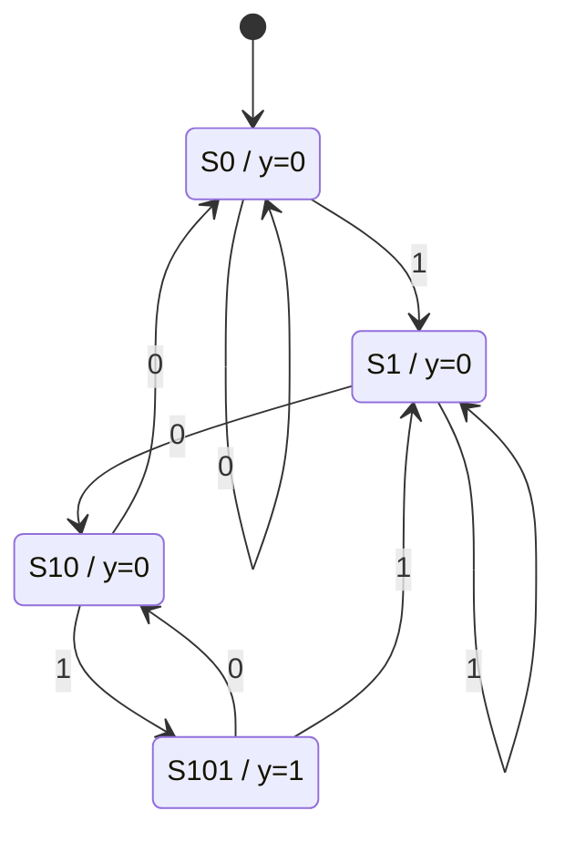

# Detector de secuencia "101" — FSM Moore

Detector de la secuencia binaria `101` sobre una entrada serial `x`, implementado como
máquina de estados finitos de tipo **Moore** en SystemVerilog.

El detector **admite solapamiento**: el último `1` de una detección puede actuar como el
primer `1` de la siguiente.

---

## Interfaz

| Señal   | Dirección | Ancho | Descripción                                     |
|---------|-----------|-------|-------------------------------------------------|
| `clk`   | input     | 1     | Reloj del sistema, activo por flanco de subida  |
| `rst_n` | input     | 1     | Reset **asíncrono**, **activo-bajo**            |
| `x`     | input     | 1     | Entrada serial, un bit por ciclo                |
| `y`     | output    | 1     | Salida de detección; vale 1 durante un ciclo    |

---

## Diagrama de estados

```
        ┌── 0 ──┐                ┌── 1 ──┐
        │       │                │       │
        │       ▼                │       ▼
      ┌─┴─────────┐          ┌───┴────────┐          ┌───────────┐          ┌───────────┐
 ───> │    S0     │── 1 ───> │    S1      │── 0 ───> │    S10    │── 1 ───> │   S101    │
reset │   y = 0   │          │   y = 0    │          │   y = 0   │          │   y = 1   │
      └───────────┘          └────────────┘          └───────────┘          └───────────┘
```

Aristas de retorno (no dibujadas arriba para no cruzar líneas):

```
   S10  ── 0 ──▶ S0      "100" : no queda ningún prefijo útil
   S101 ── 0 ──▶ S10     "1010": sobrevive el sufijo "10"
   S101 ── 1 ──▶ S1      "1011": sobrevive el sufijo "1"   ← solapamiento
```

Notar que las aristas se etiquetan **solo con `x`**. Por ser una máquina de Moore, la
salida no pertenece a la transición sino al estado, y por eso se anota **dentro del nodo**
(`y = 1` únicamente en `S101`).

<details>
<summary>Versión Mermaid (se renderiza en GitHub)</summary>



</details>

---

## Significado de los estados

Cada estado representa **el prefijo más largo del patrón `101` que se lleva acumulado**:

| Estado | Prefijo acumulado | Interpretación                                     |
|--------|-------------------|----------------------------------------------------|
| `S0`   | *(vacío)*         | No hay nada útil acumulado                         |
| `S1`   | `1`               | Se vio un `1`, puede ser el inicio del patrón      |
| `S10`  | `10`              | Se vio `10`, falta el `1` final                    |
| `S101` | `101`             | Patrón completo → **detección**                    |

Esta interpretación es la que hace que el solapamiento funcione sin casos especiales: en
cada transición se pasa al estado que representa el **sufijo más largo de la cadena vista
que sigue siendo prefijo de `101`**. La máquina nunca descarta información aprovechable.
