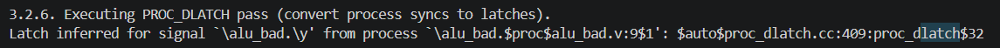
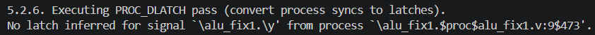
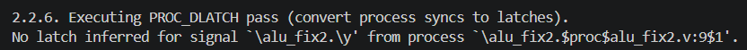

## 1. Análisis del bug

```verilog
always_comb begin
    case (op)
        2'b00: y = a + b;
        2'b01: y = a - b;
        2'b10: y = a & b;
    endcase
end
```

`op` es de 2 bits y admite cuatro valores; el `case` enumera tres. Con `op == 2'b11` ninguna rama hace match y `y` **no recibe asignación**.

En un bloque combinacional, "no asignar" no significa "salida indefinida": significa *conservar el valor anterior*. Eso es memoria, y la síntesis solo puede implementarlo con un **latch transparente**, sensible a nivel y no a flanco.

La causa raíz no es el opcode `2'b11` en particular, sino la **asignación no exhaustiva** en un camino de ejecución del `always_comb`.

### Por qué es un problema

| Aspecto | Consecuencia |
|---|---|
| Timing | El STA debe tratar caminos transparentes; aparece *time borrowing* y paths difíciles de cerrar. |
| Testabilidad | Los latches complican la inserción de scan chains para DFT. |
| Predictibilidad | La salida depende del **historial** de entradas, no solo de su valor actual. |
| Intención | Es accidental: el RTL describe combinacional y el silicio implementa estado. |

### Evidencia de comportamiento

Secuencia dirigida sobre las tres implementaciones:

| t (ns) | op | a | b | buggy | fix1 | fix2 |
|---|---|---|---|---|---|---|
| 10 | `00` | 42 | 7 | 49 | 49 | 49 |
| 20 | `01` | 42 | 7 | 35 | 35 | 35 |
| 30 | `10` | 60 | 12 | 12 | 12 | 12 |
| 40 | `11` | 60 | 12 | **12** | 0 | 0 |
| 50 | `11` | 99 | 33 | **12** | 0 | 0 |
| 60 | `11` | −70 | 5 | **12** | 0 | 0 |
| 70 | `11` | 11 | −88 | **12** | 0 | 0 |
| 80 | `00` | 11 | −88 | −77 | −77 | −77 |

La firma del latch es la salida congelada en 12 durante cuatro instantes mientras `a` y `b` cambian por completo. `fix1` y `fix2` transicionan exactamente en el flanco de `op`; la versión con bug arrastra el valor de `t=30` a través de esa frontera.

En simulación aleatoria (256 vectores), `alu_buggy` retuvo el valor previo en los **72/72** vectores con `op=2'b11`.

### Detección estática

`verilator --lint-only -Wall`:

```
alu_buggy: %Warning-CASEINCOMPLETE: Case values incompletely covered (example pattern 0x3)
alu_fix1:  sin warnings
alu_fix2:  sin warnings
```

Verilator identifica el patrón faltante sin simular. Nota metodológica: el warning emitido es `CASEINCOMPLETE`, no `LATCH`. Se verificó que suprimiendo el primero, `LATCH` tampoco dispara — Verilator reserva ese warning para `if` sin `else`, y atrapa el `case` incompleto por la vía de cobertura sintáctica. Ambos señalan el mismo defecto (asignación no exhaustiva) y deben tratarse con igual severidad.

### Confirmación en síntesis

```
yosys -p "read_verilog -sv alus.sv; synth -top alu_buggy; stat"
```



*Figura 1 — `alu_buggy`: la síntesis aborta en el pass `PROC_DLATCH`.*

```
ERROR: Latch inferred for signal `\alu_buggy.\y' from always_comb process
       `\alu_buggy.$proc$alus.sv:0$1'.
```

Yosys no emite un warning: **aborta**. `always_comb` es una promesa de lógica puramente combinacional; cuando el pass `PROC_DLATCH` determina que hace falta un elemento de memoria, la promesa está rota y la herramienta se niega a continuar. Con `always @*` en su lugar no habría error — inferiría una celda `$_DLATCH_` y seguiría adelante en silencio. Usar `always_comb` convierte el defecto en un fallo duro de build.

---

## 2. Comparativa de las correcciones

| Versión | Estrategia | Latch |
|---|---|---|
| `alu_buggy` | *(sin cubrir `2'b11`)* | **Sí** |
| `alu_fix1` | rama `default` dentro del `case` | No |
| `alu_fix2` | pre-asignación incondicional antes del `case` | No |

```verilog
// fix1                              // fix2
always_comb begin                    always_comb begin
    case (op)                            y = '0;
        2'b00: y = a + b;                case (op)
        2'b01: y = a - b;                    2'b00: y = a + b;
        2'b10: y = a & b;                    2'b01: y = a - b;
        default: y = '0;                     2'b10: y = a & b;
    endcase                              endcase
end                                  end
```

Ambas producen la misma tabla de verdad: **son el mismo circuito**. Los 256 vectores no arrojaron una sola divergencia entre `fix1` y `fix2` en ninguno de los cuatro opcodes. La elección es de estilo y mantenibilidad, no de función.

### Evidencia estructural

Ambas sintetizan sin abortar y el netlist resultante no contiene celdas de memoria:



*Figura 2 — `alu_fix1`: solo celdas combinacionales, ningún `$_DLATCH_`.*



*Figura 3 — `alu_fix2`: conteo de celdas idéntico al de `fix1`.*

```
=== alu_fix2 ===
   Number of cells:                116
     $_ANDNOT_   46     $_MUX_      7     $_XOR_     19
     $_AND_       2     $_NAND_    13     $_XNOR_     3
     $_NOT_       9     $_NOR_      4     $_OR_      11
                        $_ORNOT_    2
```

La ausencia de `$_DLATCH_` en el inventario de celdas es la prueba estructural de que el latch desapareció, complementaria a la evidencia de comportamiento de la sección 1: la simulación demuestra *qué hace* el circuito, el netlist demuestra *de qué está hecho*. Que ambas versiones den el mismo conteo confirma que las dos descripciones colapsan al mismo hardware.

### Robustez frente a valores desconocidos

Se contrastó además una tercera estrategia descartada (`alt`): enumerar `2'b11: y = '0;` como cuarta rama, sin `default` ni pre-asignación. Completa los cuatro opcodes legales, pero no cubre `op` con bits en X o Z:

| `op` | buggy | fix1 | fix2 | alt |
|---|---|---|---|---|
| `2'b10` (referencia, `y`=12) | 12 | 12 | 12 | 12 |
| `2'bx0` | 12 | **0** | **0** | 12 |
| `2'bzz` | 12 | **0** | **0** | 12 |
| `2'b11` | 12 | **0** | **0** | 0 |

`alt` retiene el valor previo ante X y Z: el `case` compara por igualdad de 4 estados y ninguna rama coincide. Es el mismo latch, reintroducido en simulación — y con la agravante de que devuelve un valor plausible en vez de propagar la indefinición, enmascarando bugs de inicialización. Solo `fix1` y `fix2` quedan definidas en los cuatro escenarios.

### Criterios de elección

| Criterio | `fix1` (`default`) | `fix2` (pre-asignación) |
|---|---|---|
| Elimina el latch | Sí | Sí |
| Hardware sintetizado | Idéntico | Idéntico |
| Si `op` se ensancha a 3 bits | Sigue cubierto | Sigue cubierto |
| Si `op` contiene X o Z | Definido (`0`) | Definido (`0`) |
| El `case` lista solo operaciones reales | No | **Sí** |
| Escala a varias salidas | Un `default` por salida y por rama | **Todos los defaults en un punto** |
| El valor por defecto es visible de un vistazo | Al final del `case` | **En la primera línea** |

**Recomendación: `fix2`.** Empatan en función, en hardware y en robustez ante X. La ventaja está en la estructura del código: separa *qué vale la salida cuando no pasa nada* de *qué operaciones existen*. El `case` queda como tabla limpia de opcodes implementados, sin una rama artificial que no corresponde a ninguna operación.