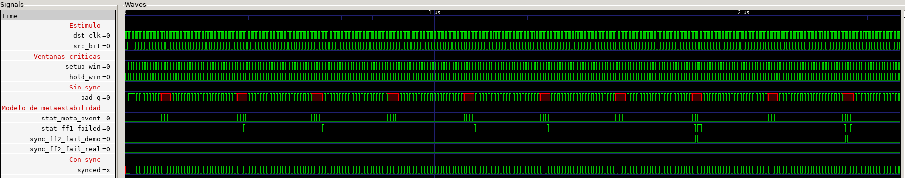

# Ejercicio 1: Sincronizador de doble Flip-Flop

Este ejercicio implementa y prueba un sincronizador para transferir una señal de un
dominio de reloj de origen a un dominio de destino. Incluye un modelo estadistico de
metastabilidad solo para simulacion; ese modelo no representa ni inyecta el estado
analogico de un flip-flop real.

## 1. Implementacion del sincronizador

`dff_sync2.v` implementa un pipeline parametrizable de `STAGES` flip-flops, todos
muestreados con `dst_clk`. En la configuracion por defecto hay dos etapas:

1. `src_bit` se captura en `pipe[0]`.
2. En los flancos siguientes, el dato se desplaza hacia las etapas superiores.
3. `synced` se toma de `pipe[STAGES-1]`, por lo que con dos etapas el dato llega a
   la salida despues de dos flancos de `dst_clk`.

El reset es sincrono y activo en bajo: cuando `rst` vale cero en un flanco de reloj,
se limpian todas las etapas. El encadenamiento de dos flip-flops reduce la
probabilidad de que una metastabilidad capturada por la primera etapa se propague a
la logica posterior. No hace que esa probabilidad sea matematicamente cero.

El parametro `TAU_DEMO` de `dff_sync2` se conserva para mostrar las tres
configuraciones de la consigna, pero la logica funcional del sincronizador no lo usa.
Las estadisticas se calculan aparte en `meta_model.v`; no cambian `synced`.

### Modelo estadistico

`meta_model.v` detecta cambios de `src_bit` dentro de las ventanas de setup y hold y
sorteara un tiempo de resolucion exponencial. Para un periodo de destino `T` y una
constante `tau`, usa las probabilidades:

| Evento | Probabilidad modelada |
|---|---:|
| FF1 no resuelve en un periodo | `exp(-T/tau)` |
| FF2 no resuelve en dos periodos | `exp(-2T/tau)` |

Con `T = 5000 ps` (200 MHz) y `tau = 3000 ps`, la probabilidad estimada para que
FF2 no resuelva es `exp(-10000/3000)`, aproximadamente 3.6 %. Con `tau = 50 ps`,
`exp(-200)` es aproximadamente `1e-87`, por lo que no se esperan fallos FF2 en esta
simulacion.

El modelo presenta las ventanas `setup_win` y `hold_win`, y los pulsos
`stat_meta_event`, `stat_ff1_failed`, `sync_ff2_fail_demo` y `sync_ff2_fail_real`.
Sirven para analizar el comportamiento estadistico en GTKWave, pero no convierten la
simulacion digital en una medicion analogica del dispositivo.

## 2. Testbench

`tb_dff_sync2.v` instancia tres sincronizadores con `TAU_DEMO=0`, `3000` y `50`, y
una instancia de `meta_model` configurada con `TAU_DEMO=3000` y `TAU_REAL=50`. La
salida de cada sincronizador se compara en cada flanco con un pipeline de referencia
de dos etapas. La comparacion se hace 1 ps despues del flanco para dejar que se
actualicen las asignaciones no bloqueantes. El checker comprueba tambien el reset
activo en bajo.

Despues de verificar la propagacion de un valor conocido, el testbench genera 2000
toggles. El intervalo entre cambios es 4.9 ns mientras que el reloj tiene un periodo
de 5 ns; asi, la fase de cada cambio avanza 100 ps respecto del reloj y recorre 50
posiciones de fase por barrido. El `SEED=12345` del modelo hace reproducibles los
contadores con Icarus Verilog.
La fase inicial se elige con un desfase de 50 ps respecto de la grilla de 100 ps, 
para que ningún toggle coincida exactamente con un flanco de dst_clk. Sin ese desfase, 
40 toggles caen en el mismo instante que el flanco y el resultado del checker depende 
del orden en que el simulador ejecuta los procesos.

El testbench comprueba que:

- Se apliquen exactamente 2000 toggles.
- Los eventos meta y fallos FF1/FF2 demo esten dentro de rangos estadisticos amplios.
- No haya fallos FF2 en el escenario real de `tau=50 ps`.
- La salida de cada instancia coincida en cada flanco con el pipeline de referencia 
(latencia de dos flancos y reset activo en bajo). Como TAU_DEMO no altera la lógica de 
dff_sync2, las tres instancias son funcionalmente idénticas; conservar las tres 
documenta las configuraciones de la consigna..

Al final imprime una linea `SUMMARY` que consume `run.sh`, ademas del resumen
estadistico generado por `meta_model.v`.

## 3. Ejecucion

Requisitos para completar la simulacion y la inspeccion visual: Icarus Verilog
(`iverilog` y `vvp`) y GTKWave.

Desde este directorio:

```sh
./run.sh
```

El script compila, ejecuta la simulacion y compara cada metrica con el valor exacto
o el rango esperado. Termina con codigo distinto de cero si falla la compilacion,
una asercion del testbench o una comparacion del resumen. Con una sesion grafica
disponible, abre automaticamente `tb_dff_sync2.vcd` en GTKWave. En un entorno sin
interfaz grafica, la simulacion termina normalmente y deja el VCD para inspeccion
posterior desde una sesion de escritorio.

Tambien se puede compilar sin el script:

```sh
iverilog -g2012 -o sim dff_sync2.v tb_dff_sync2.v
vvp sim
```

## 4. Resultados y conclusiones

En una ejecucion con Icarus Verilog, seed `12345` y un periodo de reloj de 5 ns,
la simulacion aplica exactamente 2000 cambios a `src_bit` y obtiene estos
contadores:

| Metrica | Resultado |
|---|---:|
| Toggles de origen | 2000 |
| Eventos meta | 280 |
| Fallos FF1 | 49 |
| Fallos FF2 demo (`tau=3000 ps`) | 10 |
| Fallos FF2 real (`tau=50 ps`) | 0 |

El modelo define una ventana de setup de 500 ps antes de cada flanco de subida
(`T_SETUP`) y una ventana de hold de 250 ps despues del flanco (`T_HOLD`). Por eso,
en cada periodo de 5000 ps hay `500 ps + 250 ps = 750 ps` dentro de ventanas
criticas. Si los toggles estuvieran distribuidos continuamente y de manera
uniforme, esas ventanas cubririan `750/5000 = 15 %` del periodo, lo que daria
cerca de 300 eventos meta en 2000 cambios.

En esta prueba los cambios no tienen fase aleatoria: ocurren cada 4.9 ns, mientras
que el reloj se repite cada 5 ns. La diferencia de 100 ps hace que cada toggle
caiga 100 ps antes respecto del flanco que el anterior. Asi se recorren 50
posiciones discretas de fase antes de repetir el barrido. Las posiciones quedan a 
50, 150, …, 4950 ps del flanco; 7 de ellas (a 50, 150 y 250 ps antes... ) caen 
dentro de los 750 ps críticos. Como el barrido se repite 40 veces, se obtienen 
`40 x 7 = 280` eventos meta.

`tau` es la constante de tiempo de la distribucion exponencial que modela cuanto
tarda en resolverse un evento metaestable. Cuanto mayor es `tau`, mas lenta es la
resolucion y mayor es la probabilidad de que el evento persista hasta el siguiente
flanco. `tau=3000 ps` es un valor aumentado intencionalmente para la demostracion:
con un periodo de 5000 ps, la probabilidad modelada de que FF1 no se resuelva en
un periodo es `exp(-5000/3000)`, y la de que FF2 no se resuelva en dos periodos es
`exp(-10000/3000)`, cerca de 3.6 %. Por eso los fallos FF1 y los 10 fallos FF2 demo
se pueden observar en la simulacion.

En cambio, `tau=50 ps` es el valor aproximado de sky130 usado para el escenario
realista. Al reducir `tau`, el tiempo de resolucion modelado se acorta y la
probabilidad de que FF2 siga sin resolver despues de dos periodos pasa a
`exp(-2 x 5000/50) = exp(-200)`, aproximadamente `1.38e-87`. Por eso se observaron
0 fallos FF2 reales. El cambio de `tau` modifica la estadistica del modelo, no la
salida funcional `synced` del sincronizador.

### Que muestra la captura de GTKWave



Las trazas `setup_win` y `hold_win` muestran las ventanas breves alrededor de los
flancos del reloj de destino. `stat_meta_event` pulsa cuando un cambio de `src_bit`
cae dentro de una de esas ventanas. Solo una parte de esos eventos activa
`stat_ff1_failed`, que indica que FF1 no se resolvio a tiempo. Menos eventos llegan
a `sync_ff2_fail_demo`, que indica un fallo de FF2 para `tau=3000 ps` y aparece con
el retardo asociado al segundo flanco. Para `tau=50 ps` no se registraron fallos
de FF2 (`sync_ff2_fail_real`).

### Conclusion

El testbench confirma que el sincronizador entrega el dato con dos flancos de 
latencia y que el reset activo en bajo limpia el pipeline. Tambien muestra que al 
usar el `tau` alto de demostracion se observan fallos estadisticos, mientras que 
con el `tau` aproximado de sky130 no se observa ningun fallo de FF2 en esta corrida.

Esto valida el comportamiento digital del diseño y la coherencia del modelo de
simulacion, no una tasa fisica de fallos del chip. `meta_model.v` no representa la
evolucion analogica de la metastabilidad ni altera `synced`; sus pulsos son
diagnosticos. El caso `bad_cross` sin sincronizador no esta incluido en esta
captura ni en esta prueba.
